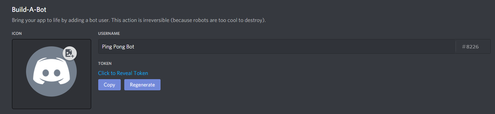
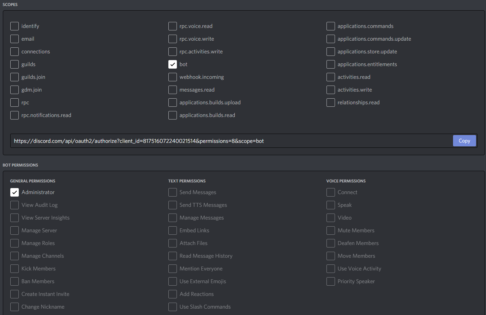

---

## Before we get started coding...

Before we start coding, we must first create a new bot application on the [Discord Development Portal](https://discord.com/login?redirect_to=%2Fdevelopers%2Fapplications). If you already have a token, you can skip this section and continue on with the tutorial.

Once you login, you will see a screen that looks like this:

Click on `New Application` to create a new bot application.

This will open up a new window which will prompt you to enter a name for your bot. For the purpose of the upcoming tutorial, I will name my bot _Ping Pong Bot_.

Once you have created a bot application, we will want to navigate to the left sidebar and click on the `Bot` tab.

Now click on `Add Bot`. This will prompt you with a confirmation window, click `Yes, do it!`.

We are now able to copy our bots token and start coding!

## Getting an invite link for our bot

Now that we have created our bot on the [Discord Develoment Portal](https://discord.com/login?redirect_to=%2Fdevelopers%2Fapplications), we can get an invite link for our bot. This will allow us to invite our bot to Discord Servers.

Navigate to the `OAuth2` tab on the Discord Development Portal. This page allows us to setup permissions for our bot. To make things simple, we will just give our bot the `Administrator` permission.

Now we can copy the bots invite link and invite it to our Discord Server!
