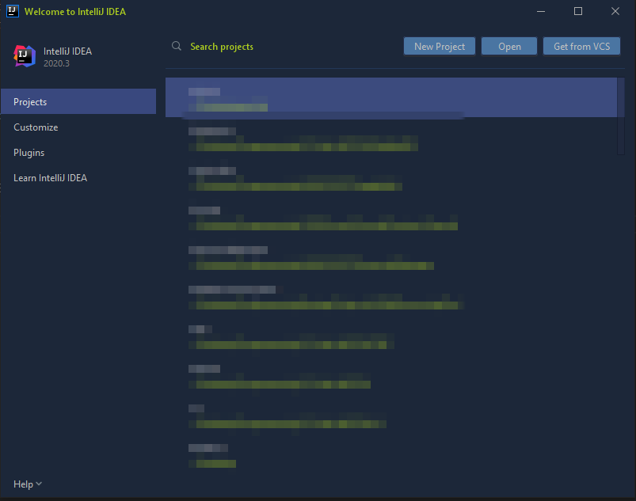
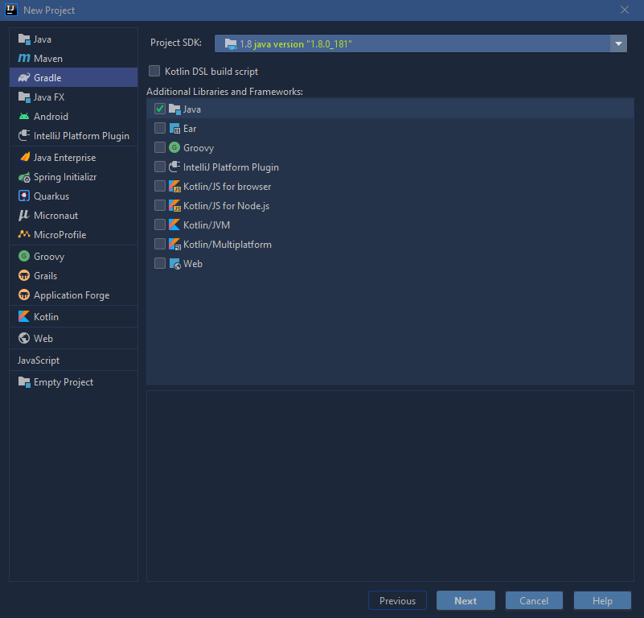
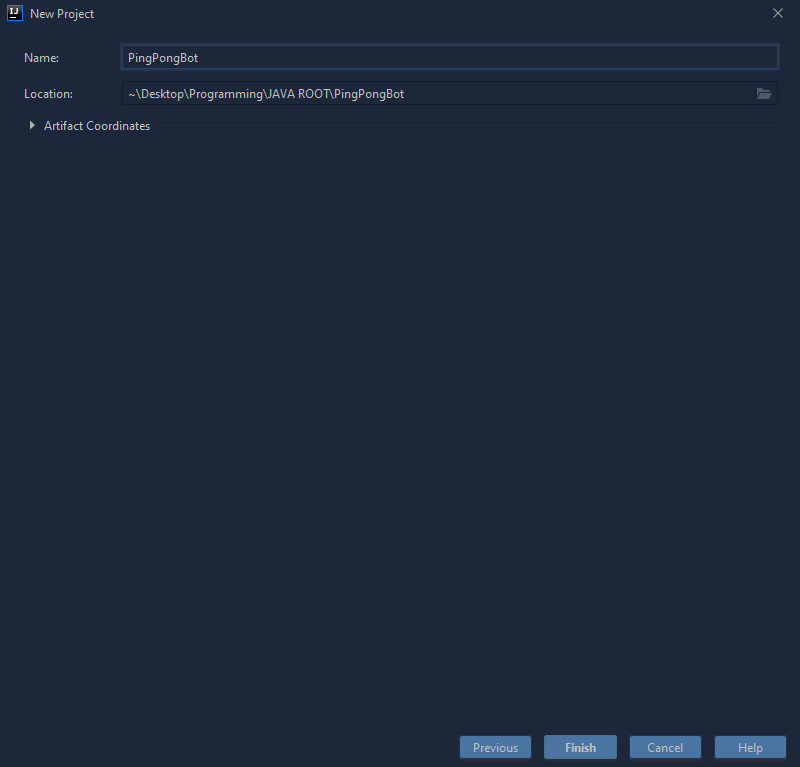
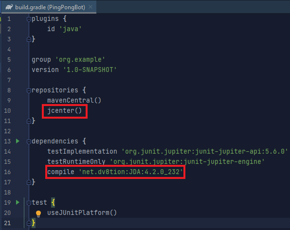

---

## Setting up our IDE

Now that we have our bots token and invite link, we can start to develop our bot.

Open IntelliJ IDEA and you will see this screen _(Note: Your theme may be different from mine, but this will not affect the tutorial. If you would like to get my theme, install the [Gadianto plugin](https://plugins.jetbrains.com/plugin/12334-gradianto) via the `Plugins` tab)_

Click on `New Project`, then select `Gradle` and make sure you have downloaded the JDK which includes the Project SDK. It should look like this

Next, we will give our project a name. I will name my bot PingPongBot. Click `Finish`.

Now wait for Gradle to build our project. Gradle will help us manage our projects dependencies, such as JDA. Once Gradle is finished building your project, your project should look like this

Now that Gradle has finished configuring and building our project, we can add our dependencies. For this tutorial, the only dependency that we will need is the Java Discord API (JDA).

We can add this dependency by navigating to the build.gradle file and opening it. You can find the [latest version of JDA here](https://bintray.com/dv8fromtheworld/maven/JDA/). Your build.gradle file should now look like this

If your project has auto import disabled, you will see a refresh icon on the top right hand side of the editor, click this to rebuild your project with the new dependency.

Now that we have our JDA dependency added, we can start developing our bot!
