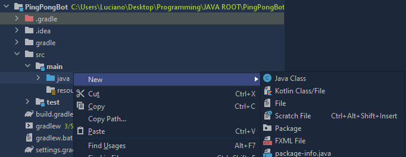
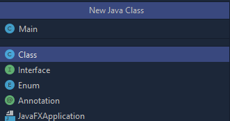
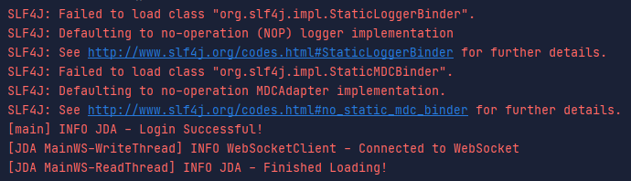

---

## Creating the main class

Now that we have our dependencies installed, we need to create our main class which will hold all the code for this tutorial.

Navigate to the `java` folder in `src/main`. Then right click on the `java` folder and go to New -> Java Class.



Give your Java Class a name of `Main`. Then press `ENTER`



## Creating the main method

Now that we have an empty Main class, we can create our main method. To do this, type the following code (if you are on IntelliJ IDEA you can just type `psvm` and then `ENTER` which will automatically generate the main method)

```java {2-4}
public class Main {
    public static void main(String[] args) {

    }
}
```

After creating the main method, we can now create the JDA Object via the JDABuilder class. This will allow us to add the token to our bot and add other options to our bot.

Copy the token from the _Discord Development Portal_ and paste it where it says `INSERT_TOKEN_HERE`.

```java {1,5}
import net.dv8tion.jda.api.JDABuilder;

public class Main {
    public static void main(String[] args) {
        JDABuilder builder = JDABuilder.createLight("INSERT_TOKEN_HERE");
    }
}
```

After adding the token to your JDABuilder we can now finally get the bot online! To build the JDA instance and connect the bot to discord, we call the method `JDABuilder#build()`

```java {7}
import net.dv8tion.jda.api.JDABuilder;

public class Main {
    public static void main(String[] args) {
        JDABuilder builder = JDABuilder.createLight("INSERT_TOKEN_HERE");

        builder.build();
    }
}
```

You may now notice an error, this is because we have an unhandled exception ` javax.security.auth.login.LoginException`. To catch this error, we must add `throws LoginException` to the main method.

```java {3,6}
import net.dv8tion.jda.api.JDABuilder;

import javax.security.auth.login.LoginException;

public class Main {
    public static void main(String[] args) throws LoginException {
        JDABuilder builder = JDABuilder.createLight("INSERT_TOKEN_HERE");

        builder.build();
    }
}
```

Now we can finally run our bot! Click the green button left of the class name and click `Run 'Main.main()'`.


After running, you will see something that looks like this in the console.



The first 6 lines show up because we do not have [slf4j](http://www.slf4j.org/) implemented yet. Don't worry though, we can ingnore those messages for now. The last 3 lines inform us that the bot has successfully logged on! But our bot has no functionality as of right now, let's fix that.

## Adding Functionality

In order to give our bot functionality, we must add a `ListenerAdapter` to our JDA instance. We will now override the `onGuildMessageReceived` method so we can listen for messages _(A guild is a discord server)_.

```java {2,3-4,15-18}
import net.dv8tion.jda.api.JDABuilder;
import net.dv8tion.jda.api.events.message.guild.GuildMessageReceivedEvent;
import net.dv8tion.jda.api.hooks.ListenerAdapter;
import org.jetbrains.annotations.NotNull;

import javax.security.auth.login.LoginException;

public class Main extends ListenerAdapter {
    public static void main(String[] args) throws LoginException {
        JDABuilder builder = JDABuilder.createLight("YOUR_TOKEN_GOES_HERE");

        builder.build();
    }

    @Override
    public void onGuildMessageReceived(@NotNull GuildMessageReceivedEvent event) {

    }
}
```

Essentially, whenever a user sends a message in the discord server, the `onGuildMessageReceived` method will be called. You will be able to access information about that message using the event property.

Shortcut: You can automatically generate this method by simply typing in `onGuildMessageReceived` and pressing `ENTER`.

Now, we can add some logic within our `onGuildMessageReceived` method that will capture the senders message and check if it equals `!ping`. If it does, it will reply with `pong!`.

```java {3-7}
@Override
public void onGuildMessageReceived(@NotNull GuildMessageReceivedEvent event) {
    String message = event.getMessage().getContentDisplay();

    if(message.equalsIgnoreCase("!ping")) {
        event.getChannel().sendMessage("pong!").queue();
    }
}
```

To complete this bot, we must now create a new instance of our main class in the JDABuilder so it knows where to send events.

Full Code:

```java {11}
import net.dv8tion.jda.api.JDABuilder;
import net.dv8tion.jda.api.events.message.guild.GuildMessageReceivedEvent;
import net.dv8tion.jda.api.hooks.ListenerAdapter;
import org.jetbrains.annotations.NotNull;

import javax.security.auth.login.LoginException;

public class Main extends ListenerAdapter {
    public static void main(String[] args) throws LoginException {
        JDABuilder builder = JDABuilder.createLight("YOUR_TOKEN_GOES_HERE");
        builder.addEventListeners(new Main());
        builder.build();
    }

    @Override
    public void onGuildMessageReceived(@NotNull GuildMessageReceivedEvent event) {
        String message = event.getMessage().getContentDisplay();

        if(message.equalsIgnoreCase("!ping")) {
            event.getChannel().sendMessage("pong!").queue();
        }
    }
}
```

Congratulations! You can now run your bot and test it out.


