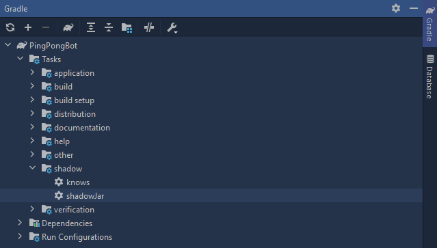

---

## Runnable Jar File

Now that we have finished our basic bot, we can build a jar file for it. This will allow us to run the bot outside of the IntelliJ IDE.

Navigate to the `build.gradle` file and make the following changes.

```groovy {3-4,7}
plugins {
    id 'java'
    id 'application'
    id "com.github.johnrengelman.shadow" version "6.1.0"
}

mainClassName = "Main"

group 'org.example'
version '1.0-SNAPSHOT'

repositories {
    mavenCentral()
    jcenter()
}

dependencies {
    testImplementation 'org.junit.jupiter:junit-jupiter-api:5.6.0'
    testRuntimeOnly 'org.junit.jupiter:junit-jupiter-engine'
    compile 'net.dv8tion:JDA:4.2.0_232'
}

test {
    useJUnitPlatform()
}
```

The gradle shadow plugin allows us to build jars. You can get the latest version of it [here](https://plugins.gradle.org/plugin/com.github.johnrengelman.shadow).

To build the jar, navigate to the right hand side of the IDE and click on Gradle tab.



Double click on the `shadowJar` to build the jar. The jar will be located in `PROJECT/build/libs`.

You can run this jar file with the following command: `java -jar output.jar`
